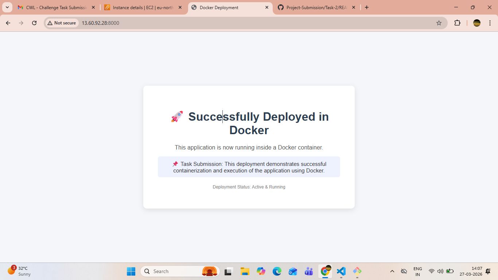

# Task 2: Docker Installation and Application Deployment

## Objective
The objective of this task is to install and configure Docker on the server, create a Docker image for a custom `index.html` page, run the application inside a Docker container, and make it accessible through the server IP address on port **8000**.

---

## Expected Outcome
The web application should be accessible through a browser using the server IP address and port:

```bash
http://13.60.92.28:8000/
```

---

# Step 1: Install and Configure Docker on the Server

## 1.1 Connect to the Server

```bash
ssh -i pem-file.pem ubuntu@public-server-ip
```

## 1.2 Update the Server

```bash
sudo apt update && sudo apt upgrade -y
```

## 1.3 Install Docker

```bash
sudo apt install -y docker.io
```

## 1.4 Enable and Start Docker

```bash
sudo systemctl enable docker
sudo systemctl start docker
```

## 1.5 Check Docker Status

```bash
sudo systemctl status docker
```

---

# Step 2: Create a Dockerfile to Host a Custom `index.html` Page

## 2.1 Create the HTML File

```bash
sudo vi index.html
```

Add your custom HTML content inside the file.

---

## 2.2 Create the Dockerfile

Create a file named `Dockerfile` and add the following content:

```dockerfile
FROM nginx:latest

COPY index.html /usr/share/nginx/html/index.html

EXPOSE 80
```

---

## 2.3 Explanation of the Dockerfile

### `FROM nginx:latest`
Uses the official **Nginx** image as the base image.  
Nginx is a lightweight and efficient web server used to host static web pages.

### `COPY index.html /usr/share/nginx/html/index.html`
Copies the custom `index.html` file into the default Nginx web root directory.

### `EXPOSE 80`
Indicates that the container serves traffic internally on **port 80**.

> **Note:** The application will still be accessed externally using **port 8000** through Docker port mapping.

---

# Step 3: Build a Docker Image Using the Dockerfile

## 3.1 Build the Docker Image

```bash
sudo docker build -t my-docker-app .
```

### Explanation
- `docker build` → Builds the Docker image
- `-t my-docker-app` → Assigns the image name as `my-docker-app`
- `.` → Uses the current directory as the build context

---

## 3.2 Check the Built Image

```bash
sudo docker images
```

This command lists all available Docker images on the server.

---

# Step 4: Run a Container from the Created Image

## 4.1 Run the Docker Container

```bash
sudo docker run -d -p 8000:80 --name docker-web-container my-docker-app
```

### Explanation
- `-d` → Runs the container in the background
- `-p 8000:80` → Maps:
  - **Host/Server Port:** `8000`
  - **Container Port:** `80`
- `--name docker-web-container` → Assigns a name to the container
- `my-docker-app` → Uses the built Docker image

---

## 4.2 Verify the Container is Running

```bash
sudo docker ps
```

This command shows the running Docker containers.

---

# Step 5: Test the Application

## 5.1 Test from the Server

```bash
curl http://13.60.92.28:8000/
```

### Output

```html
<!DOCTYPE html>
<html lang="en">
<head>
    <meta charset="UTF-8">
    <meta name="viewport" content="width=device-width, initial-scale=1.0">
    <title>Docker Deployment</title>
</head>
<body style="margin:0; padding:0; background-color:#f4f6f9; font-family:Arial, sans-serif; display:flex; justify-content:center; align-items:center; height:100vh;">

    <div style="background:#ffffff; padding:40px; border-radius:10px; box-shadow:0 4px 15px rgba(0,0,0,0.1); text-align:center; width:90%; max-width:500px;">
        
        <h1 style="color:#2c3e50; margin-bottom:20px;">
            🚀 Successfully Deployed in Docker
        </h1>
        
        <p style="color:#555; font-size:16px; margin-bottom:15px;">
            This application is now running inside a Docker container.
        </p>
        
        <p style="color:#333; font-size:15px; background:#eef2ff; padding:10px; border-radius:6px;">
            📌 Task Submission: This deployment demonstrates successful containerization and execution of the application using Docker.
        </p>

        <p style="margin-top:20px; font-size:12px; color:#888;">
            Deployment Status: Active & Running
        </p>

    </div>

</body>
</html>
```

---

## 5.2 Access in the Browser

Open the following URL in your browser:

```bash
http://13.60.92.28:8000/
```

---

# Output Screenshot



---

# Conclusion

In this task, Docker was successfully installed and configured on the server.  
A custom `index.html` page was containerized using a Dockerfile with the **Nginx** base image.  
The Docker image was built successfully, and the container was run with port mapping from **8000** (host) to **80** (container).  

As a result, the web application was successfully deployed and made accessible through:

```bash
http://13.60.92.28:8000/
```

---

# Key Commands Summary

```bash
sudo apt update && sudo apt upgrade -y
sudo apt install -y docker.io
sudo systemctl enable docker
sudo systemctl start docker
sudo systemctl status docker

sudo vi index.html
sudo vi Dockerfile

sudo docker build -t my-docker-app .
sudo docker images

sudo docker run -d -p 8000:80 --name docker-web-container my-docker-app
sudo docker ps

curl http://13.60.92.28:8000/
```
