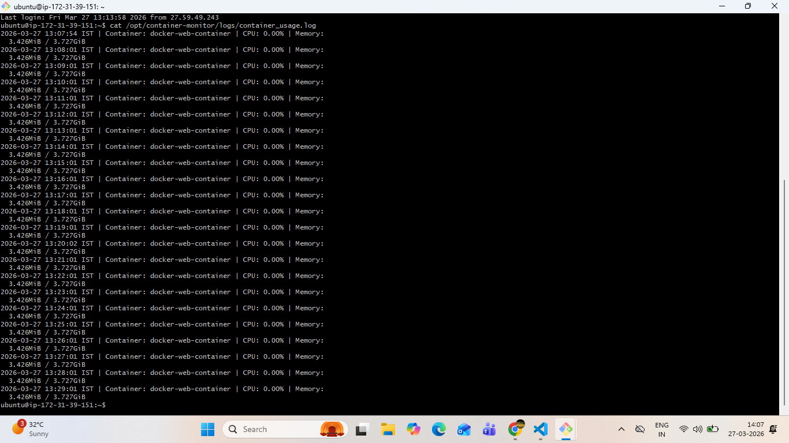

# Task 3: Monitor Container Resource Usage and Log CPU/Memory Usage Automatically

## Objective
The objective of this task is to create an automated monitoring system for a Docker container that captures:

- **CPU usage**
- **Memory usage**
- **Timestamp for each log entry**

The monitoring data is stored in a log file inside:

```bash
/opt/container-monitor/logs/
```

---

## Expected Outcome
- Automatic container monitoring
- CPU and memory usage logged every minute
- Timestamp added for each entry
- Logs stored in the required directory

---

# Step 1: Create Monitoring Directory

Create the required directory structure:

```bash
sudo mkdir -p /opt/container-monitor/logs
```

### Explanation
- `/opt/container-monitor/` → Main monitoring project directory
- `/logs/` → Stores monitoring log files

---

# Step 2: Check the Running Container Name

Use the following command to list running Docker containers:

```bash
sudo docker ps
```

### Output

```bash
CONTAINER ID   IMAGE           COMMAND                  CREATED       STATUS       PORTS                                     NAMES
b11ce8785bee   my-docker-app   "/docker-entrypoint.…"   2 hours ago   Up 2 hours   0.0.0.0:8000->80/tcp, [::]:8000->80/tcp   docker-web-container
```

### Container Name Used for Monitoring

```bash
docker-web-container
```

---

# Step 3: Create the Monitoring Script

Create the monitoring script file:

```bash
sudo vi /opt/container-monitor/monitor.sh
```

Add the following script:

```bash
#!/bin/bash

CONTAINER_NAME="docker-web-container"

LOG_FILE="/opt/container-monitor/logs/container_usage.log"

TIMESTAMP=$(date '+%Y-%m-%d %H:%M:%S %Z')

STATS=$(sudo docker stats --no-stream --format "{{.CPUPerc}}, {{.MemUsage}}" $CONTAINER_NAME 2>/dev/null)

if [ -n "$STATS" ]; then
    echo "$TIMESTAMP | Container: $CONTAINER_NAME | CPU: $(echo $STATS | cut -d',' -f1) | Memory: $(echo $STATS | cut -d',' -f2)" >> $LOG_FILE
else
    echo "$TIMESTAMP | Container: $CONTAINER_NAME | Status: Not Running" >> $LOG_FILE
fi
```

---

# Step 4: Script Explanation

## `#!/bin/bash`
This tells the system to execute the script using the **Bash shell**.

---

## `CONTAINER_NAME="docker-web-container"`
This stores the **Docker container name** in a variable.

It specifies **which container to monitor**.

---

## `LOG_FILE="/opt/container-monitor/logs/container_usage.log"`
This stores the path of the log file where monitoring data will be saved.

---

## `TIMESTAMP=$(date '+%Y-%m-%d %H:%M:%S %Z')`
This captures the **current date and time** along with the timezone.

### Example:
```bash
2026-03-27 13:07:54 IST
```

This ensures every log entry contains the **exact local timestamp**.

---

## `STATS=$(sudo docker stats --no-stream --format "{{.CPUPerc}}, {{.MemUsage}}" $CONTAINER_NAME 2>/dev/null)`

This command collects the **CPU and memory usage** of the specified Docker container.

### Explanation of the command

### `docker stats`
Displays resource usage statistics for running Docker containers.

### `--no-stream`
Captures **only one snapshot** and exits.

> This is useful because the script is executed every minute using cron, so continuous live monitoring is not needed.

### `--format "{{.CPUPerc}}, {{.MemUsage}}"`
This formats the output to show only:
- CPU usage percentage
- Memory usage

### `$CONTAINER_NAME`
Specifies the container to monitor.

### `2>/dev/null`
Suppresses unnecessary error messages, such as when the container is not running.

---

## `if [ -n "$STATS" ]; then`
This checks whether the `STATS` variable contains any data.

### Meaning of `-n`
```bash
-n
```
means:

> Check if the string is **not empty**

If the container is running, `STATS` will contain CPU and memory usage values.

---

## Logging CPU and Memory Usage

```bash
echo "$TIMESTAMP | Container: $CONTAINER_NAME | CPU: $(echo $STATS | cut -d',' -f1) | Memory: $(echo $STATS | cut -d',' -f2)" >> $LOG_FILE
```

This line appends the monitoring output into the log file.

### Explanation
- `echo` → Prints the formatted log line
- `$TIMESTAMP` → Adds date and time
- `$CONTAINER_NAME` → Adds container name
- `cut -d',' -f1` → Extracts CPU usage
- `cut -d',' -f2` → Extracts memory usage
- `>> $LOG_FILE` → Appends output to the log file

---

## If Container is Not Running

```bash
else
    echo "$TIMESTAMP | Container: $CONTAINER_NAME | Status: Not Running" >> $LOG_FILE
fi
```

If the container is not running, CPU and memory usage cannot be captured.

So instead, the script logs:

```bash
Status: Not Running
```

This makes the script more reliable and fault-tolerant.

---

# Step 5: Make the Script Executable

Run:

```bash
sudo chmod +x /opt/container-monitor/monitor.sh
```

This gives execute permission to the script.

---

# Step 6: Test the Script Manually

Run the script manually:

```bash
sudo /opt/container-monitor/monitor.sh
```

Then check the log file:

```bash
cat /opt/container-monitor/logs/container_usage.log
```

---

# Step 7: Automate Monitoring Using Cron Job

To make the script run automatically every minute, open the root crontab:

```bash
sudo crontab -e
```

Add the following line:

```bash
* * * * * /opt/container-monitor/monitor.sh
```

---

## Cron Expression Meaning

```bash
* * * * *
```

This means:

- Every minute
- Every hour
- Every day
- Every month
- Every weekday

So the script runs **once every minute automatically**.

---

# Step 8: Verify Cron Job is Added

Check the cron configuration:

```bash
sudo crontab -l
```

---

# Step 9: Check Monitoring Logs

Use the following command to verify the logs:

```bash
cat /opt/container-monitor/logs/container_usage.log
```

### Output

```bash
2026-03-27 13:07:54 IST | Container: docker-web-container | CPU: 0.00% | Memory:  3.426MiB / 3.727GiB
2026-03-27 13:08:01 IST | Container: docker-web-container | CPU: 0.00% | Memory:  3.426MiB / 3.727GiB
2026-03-27 13:09:01 IST | Container: docker-web-container | CPU: 0.00% | Memory:  3.426MiB / 3.727GiB
2026-03-27 13:10:01 IST | Container: docker-web-container | CPU: 0.00% | Memory:  3.426MiB / 3.727GiB
2026-03-27 13:11:01 IST | Container: docker-web-container | CPU: 0.00% | Memory:  3.426MiB / 3.727GiB
2026-03-27 13:12:01 IST | Container: docker-web-container | CPU: 0.00% | Memory:  3.426MiB / 3.727GiB
2026-03-27 13:13:01 IST | Container: docker-web-container | CPU: 0.00% | Memory:  3.426MiB / 3.727GiB
2026-03-27 13:14:01 IST | Container: docker-web-container | CPU: 0.00% | Memory:  3.426MiB / 3.727GiB
2026-03-27 13:15:01 IST | Container: docker-web-container | CPU: 0.00% | Memory:  3.426MiB / 3.727GiB
2026-03-27 13:16:01 IST | Container: docker-web-container | CPU: 0.00% | Memory:  3.426MiB / 3.727GiB
2026-03-27 13:17:01 IST | Container: docker-web-container | CPU: 0.00% | Memory:  3.426MiB / 3.727GiB
2026-03-27 13:18:01 IST | Container: docker-web-container | CPU: 0.00% | Memory:  3.426MiB / 3.727GiB
2026-03-27 13:19:01 IST | Container: docker-web-container | CPU: 0.00% | Memory:  3.426MiB / 3.727GiB
2026-03-27 13:20:02 IST | Container: docker-web-container | CPU: 0.00% | Memory:  3.426MiB / 3.727GiB
2026-03-27 13:21:01 IST | Container: docker-web-container | CPU: 0.00% | Memory:  3.426MiB / 3.727GiB
2026-03-27 13:22:01 IST | Container: docker-web-container | CPU: 0.00% | Memory:  3.426MiB / 3.727GiB
2026-03-27 13:23:01 IST | Container: docker-web-container | CPU: 0.00% | Memory:  3.426MiB / 3.727GiB
```

---

# Output Screenshot



---

# Conclusion

In this task, a Bash monitoring script was created to automatically monitor a Docker container’s **CPU** and **memory usage**.  
The script logs the container statistics along with **exact timestamps** into the required directory:

```bash
/opt/container-monitor/logs/
```

The monitoring was automated using a **cron job** scheduled to run **every minute**, ensuring continuous and automatic container resource tracking.

---

# Key Commands Summary

```bash
sudo mkdir -p /opt/container-monitor/logs

sudo docker ps

sudo vi /opt/container-monitor/monitor.sh
sudo chmod +x /opt/container-monitor/monitor.sh

sudo /opt/container-monitor/monitor.sh
cat /opt/container-monitor/logs/container_usage.log

sudo crontab -e
sudo crontab -l
```